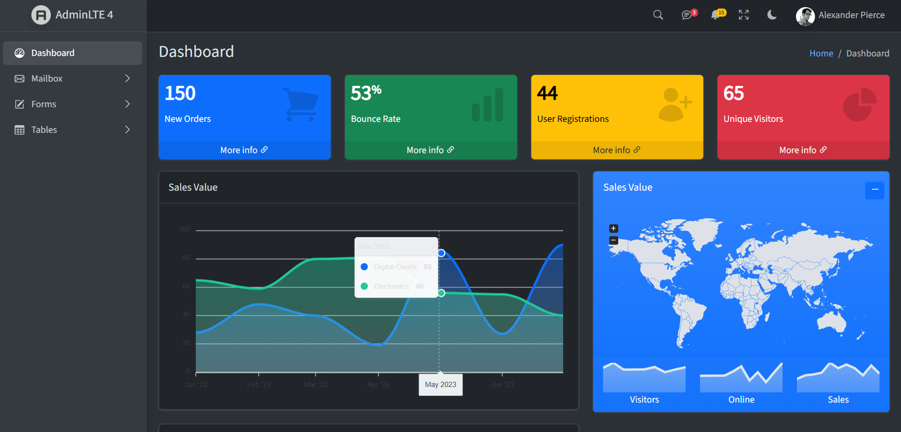
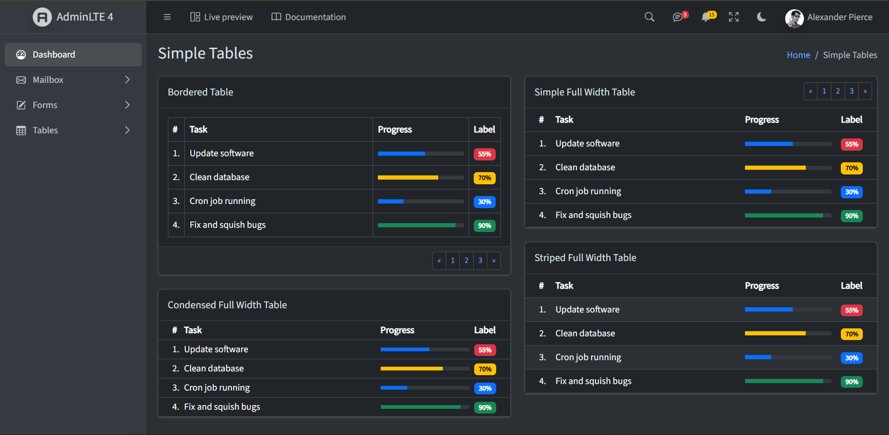
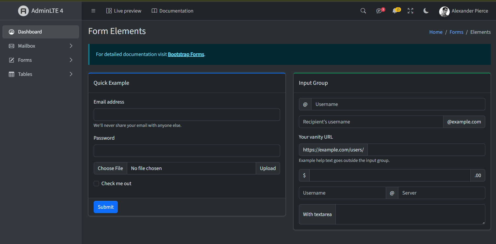
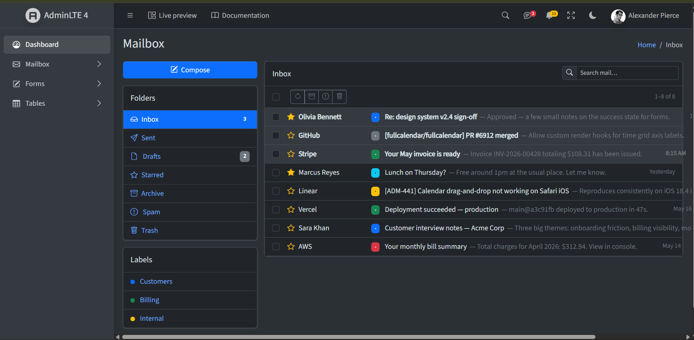
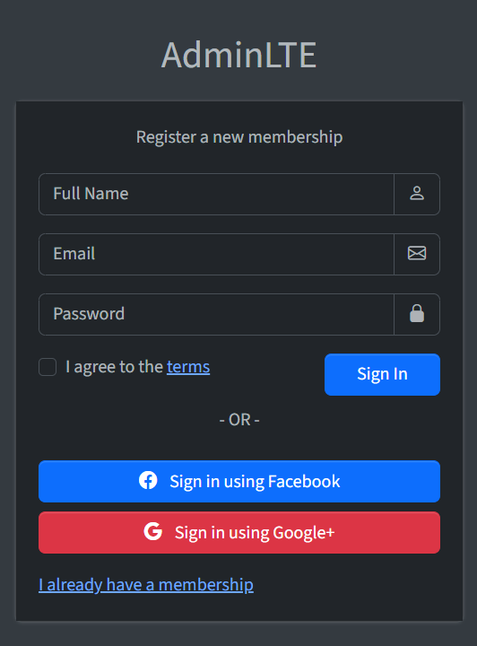
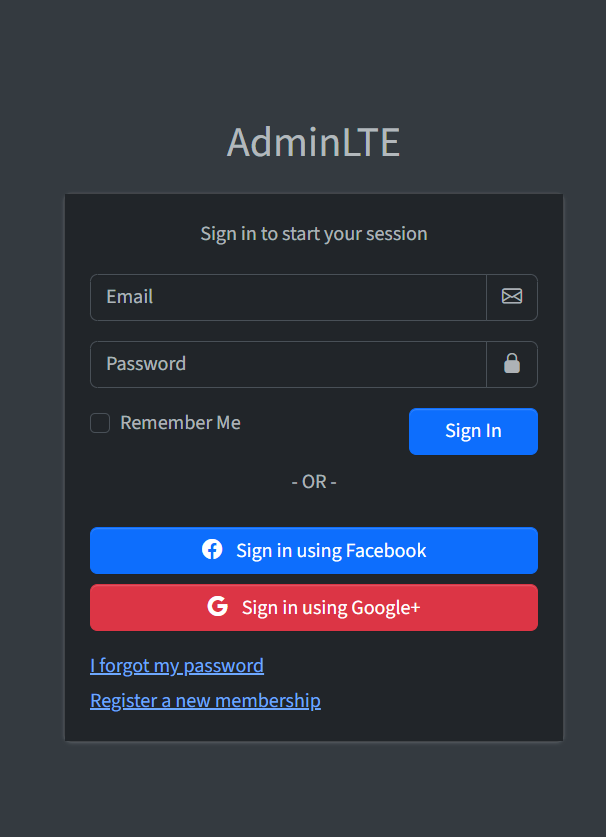

# 🖥️ Admin Panel — Node.js + MVC + Cookie-based Authentication

## 🎥 Video Explanation

[https://drive.google.com/file/d/15nNJy1vFTr7viF9m7iVPiFn07kKYU4ks/view?usp=drive_link]

A professional Admin Panel converted from static HTML (AdminLTE template) into a dynamic **Node.js + Express.js + EJS** application following the **MVC architecture pattern**, with a complete **cookie-based authentication system** (Signup, Signin, protected routes, Logout).

---

## 🎯 Project Objective

Convert a static HTML Admin Panel into a fully functional Node.js application using the MVC (Model-View-Controller) design pattern, and implement a secure authentication flow using cookies, MongoDB, and password hashing.

---

## 🚀 Features

- ✅ Dynamic dashboard with AdminLTE UI
- ✅ Tables, Forms, and Mailbox pages
- ✅ Reusable EJS partials (header/navbar, sidebar, footer)
- ✅ Active menu highlighting based on current page
- ✅ MVC folder structure (Models, Views, Controllers, Routes, Middlewares)
- ✅ MongoDB database integration via Mongoose
- ✅ User Signup with **bcrypt password hashing**
- ✅ User Signin with secure password comparison
- ✅ Cookie-based session tracking (`cookie-parser`)
- ✅ Custom **authentication middleware** to protect private routes
- ✅ Logout functionality with cookie clearing
- ✅ Responsive layout

---

## 🛠️ Tech Stack

| Technology    | Usage                   |
| ------------- | ----------------------- |
| Node.js       | Backend Runtime         |
| Express.js    | Web Framework           |
| EJS           | Templating Engine       |
| MongoDB       | Database                |
| Mongoose      | ODM for MongoDB         |
| bcrypt        | Password hashing        |
| cookie-parser | Reading/parsing cookies |
| AdminLTE      | UI Template             |
| Bootstrap 5   | CSS Framework           |

---

## 📁 Project Structure

```
AdminPanel/
│── controllers/
│   └── dashboardController.js
│── routes/
│   └── dashboardRoutes.js
│── models/
│   └── User.js
│── middlewares/
│   └── auth.js
│── views/
│   ├── partials/
│   │   ├── head.ejs
│   │   ├── navbar.ejs
│   │   ├── sidebar.ejs
│   │   └── footer.ejs
│   ├── dashboard.ejs
│   ├── tables.ejs
│   ├── forms.ejs
│   ├── mailbox.ejs
│   ├── signup.ejs
│   └── login.ejs
│── public/
│   ├── css/
│   ├── js/
│   └── assets/
│       └── screenshots/
│── app.js
└── package.json
```

---

## 🔄 MVC Flow

```
Browser Request
     ↓
app.js (Entry Point)
     ↓
routes/dashboardRoutes.js (URL Handler)
     ↓
middlewares/auth.js (Authentication Check — for protected routes)
     ↓
controllers/dashboardController.js (Logic)
     ↓
models/User.js (Database interaction, if needed)
     ↓
views/*.ejs (UI/Template)
     ↓
Browser Response
```

---

## 🔐 Authentication Flow

1. **Signup** — User submits name/email/password → password is hashed using `bcrypt` → new user document is saved in MongoDB.
2. **Signin** — User submits email/password → user is looked up by email → submitted password is compared against the stored hash using `bcrypt.compare()`.
3. **Cookie set on login** — On successful login, the user's MongoDB `_id` is stored in a cookie (`userId`) using `res.cookie()`.
4. **Route protection** — A custom `authMiddleware` checks for the `userId` cookie on every protected route (`/`, `/tables`, `/forms`, `/mailbox`). If missing, the user is redirected to `/login`.
5. **Logout** — Clears the `userId` cookie (`res.clearCookie()`) and redirects to `/login`.

---

## ⚙️ Installation & Setup

1. **Clone the repository**

```bash
git clone https://github.com/israrshaikh123/node-js.git
cd node-js/AdminPanel
```

2. **Install dependencies**

```bash
npm install
```

3. **Make sure MongoDB is running locally**

By default, the app connects to:

```
mongodb://localhost:27017/adminpanel
```

4. **Start the server**

```bash
npm start
```

5. **Open in browser**

```
http://localhost:8000
```

---

## 📸 Screenshots

### Dashboard



### Tables



### Forms



### Mailbox



### Signup



### Login



---

## 👨‍💻 Developer

**Israr** — Full Stack Development Student

---

## 📄 License

This project is for educational purposes.
