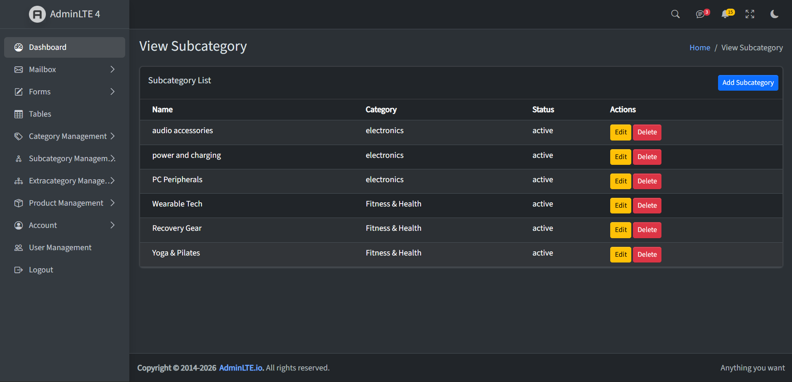
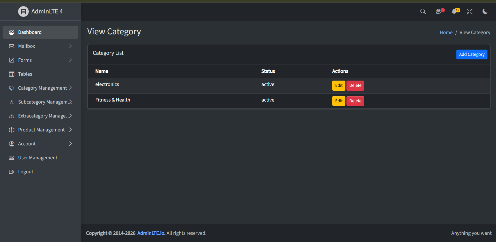
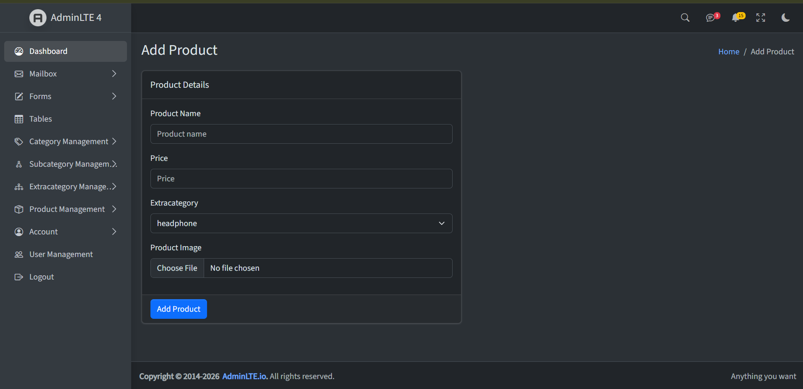
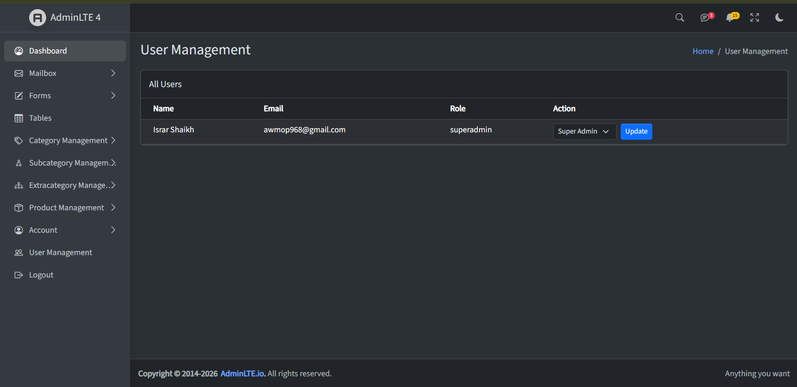
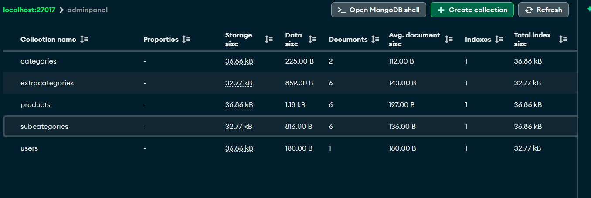

# 🖥️ Admin Panel — Node.js + MVC + Session/Passport Authentication + Role-Based CRUD

## 🎥 Video Explanation

Admin-Panel HTML To NODE-MVC Conversion: [https://drive.google.com/file/d/1YYr7xe478N4OMr-giNvkbWKpQdjVWwHX/view?usp=sharing]

Submission 1: [https://drive.google.com/file/d/15nNJy1vFTr7viF9m7iVPiFn07kKYU4ks/view?usp=drive_link]

Submission 2: [https://drive.google.com/file/d/1JIcEcxS3iqkh5aZazvT6c6iidUeQyj6I/view?usp=drive_link]

Submission 3: [[ADD_YOUR_LINK_HERE](https://drive.google.com/file/d/1_wLvtJ7R1vxuMx84gGub63OcedXznOCj/view?usp=sharing)]

A professional Admin Panel converted from static HTML (AdminLTE template) into a dynamic **Node.js + Express.js + EJS** application following the **MVC architecture pattern**, built across three stages:

- **Submission 1:** Cookie-based authentication (Signup, Signin, protected routes, Logout)
- **Submission 2:** Upgraded to **session-based authentication using Passport.js** (Local Strategy, Serialize/Deserialize, session-protected routes, Logout)
- **Submission 3:** Full **e-commerce style CRUD system** — Category → Subcategory → Extracategory → Product (with nested population and image uploads), Flash Messages, Profile Management, Change Password, OTP-based Forgot/Reset Password, Dashboard Statistics, and **Role-Based Access Control** (Super Admin / Admin / Manager / Employee)

---

## 🎯 Project Objective

Convert a static HTML Admin Panel into a fully functional Node.js application using the MVC (Model-View-Controller) design pattern, implement a secure, production-style authentication flow, and build a complete, role-protected CRUD system for managing a nested product catalog.

---

## 🚀 Features

### Core / Auth (Submissions 1 & 2)
- ✅ Dynamic dashboard with AdminLTE UI
- ✅ Tables, Forms, and Mailbox pages
- ✅ Reusable EJS partials (head, navbar, sidebar, footer)
- ✅ Active menu highlighting based on current page
- ✅ MVC folder structure (Models, Views, Controllers, Routes, Middlewares, Config)
- ✅ MongoDB database integration via Mongoose
- ✅ User Signup with **bcrypt password hashing**
- ✅ User Signin with secure password comparison
- ✅ **Session-based authentication** using `express-session`
- ✅ **Passport.js Local Strategy** for login verification
- ✅ **Serialize/Deserialize User** for session persistence
- ✅ Custom `setAuthenticated` middleware (session-based route protection)
- ✅ Logout via `req.logout()` with proper session cleanup

### CRUD & Catalog System (Submission 3)
- ✅ **Category** management — full CRUD (Add / View / Edit / Delete)
- ✅ **Subcategory** management — CRUD + linked to Category via `ObjectId` reference
- ✅ **Extracategory** management — CRUD + linked to Subcategory (nested reference)
- ✅ **Product** management — CRUD + linked to Extracategory + **image upload via Multer**
- ✅ **Mongoose `.populate()`** — including **nested populate** (Product → Extracategory → Subcategory → Category, a 3-table join)
- ✅ **Flash Messages** (`connect-flash`) — success/error feedback on every Create/Update/Delete action, wired through `res.locals` middleware so messages are available in all views

### Account Management (Submission 3)
- ✅ **Profile page** — view logged-in user's details (`req.user`)
- ✅ **Change Password** — verifies current password via `bcrypt.compare()`, hashes and saves new password
- ✅ **Forgot Password (OTP via Nodemailer)** — 6-digit OTP generated, emailed via Gmail SMTP, stored with expiry (`otp`, `otpExpiry` fields)
- ✅ **Verify OTP → Reset Password** — OTP + expiry validation, then secure password reset

### Dashboard & Access Control (Submission 3)
- ✅ **Dashboard statistics** — live counts of Categories, Subcategories, Extracategories, and Products (`countDocuments()`)
- ✅ **Role-Based Access Control (Hierarchical Access)** — `checkRole` middleware (higher-order function) restricts routes by role:
  - **Super Admin** — full access to everything
  - **Admin** — Dashboard, Category, Subcategory, Extracategory, Product
  - **Manager** — Category, Product
  - **Employee** — Product (view only)
- ✅ **User Management page** (Super Admin only) — view all users and change their roles via dropdown
- ✅ Responsive layout, sidebar with collapsible treeview navigation for all modules

---

## 🛠️ Tech Stack

| Technology      | Usage                                   |
| ---------------- | ---------------------------------------- |
| Node.js          | Backend Runtime                          |
| Express.js        | Web Framework                            |
| EJS               | Templating Engine                        |
| MongoDB           | Database                                 |
| Mongoose          | ODM for MongoDB (schemas, populate)      |
| bcrypt            | Password hashing                         |
| cookie-parser     | Reading/parsing cookies                  |
| express-session   | Server-side session management           |
| passport          | Authentication middleware framework      |
| passport-local    | Email/password authentication strategy   |
| connect-flash     | Flash messages (success/error feedback)  |
| nodemailer        | Sending OTP emails (Gmail SMTP)          |
| multer            | Handling product image uploads           |
| dotenv            | Environment variable management          |
| AdminLTE          | UI Template                              |
| Bootstrap 5       | CSS Framework                            |

---

## 📁 Project Structure

```
AdminPanel/
│── config/
│   ├── passport.js
│   ├── mailer.js
│   └── multer.js
│── controllers/
│   ├── dashboardController.js
│   ├── categoryController.js
│   ├── subcategoryController.js
│   ├── extracategoryController.js
│   ├── productController.js
│   ├── profileController.js
│   ├── passwordController.js
│   └── adminController.js
│── routes/
│   └── dashboardRoutes.js
│── models/
│   ├── User.js
│   ├── Category.js
│   ├── Subcategory.js
│   ├── Extracategory.js
│   └── Product.js
│── middlewares/
│   ├── setAuthenticated.js
│   └── checkRole.js
│── views/
│   ├── partials/
│   │   ├── head.ejs
│   │   ├── navbar.ejs
│   │   ├── sidebar.ejs
│   │   └── footer.ejs
│   ├── dashboard.ejs
│   ├── tables.ejs
│   ├── forms.ejs
│   ├── mailbox.ejs
│   ├── signup.ejs
│   ├── login.ejs
│   ├── forgotPassword.ejs
│   ├── verifyOtp.ejs
│   ├── resetPassword.ejs
│   ├── profile.ejs
│   ├── changePassword.ejs
│   ├── viewUsers.ejs
│   ├── addCategory.ejs / editCategory.ejs / viewCategory.ejs
│   ├── addSubcategory.ejs / editSubcategory.ejs / viewSubcategory.ejs
│   ├── addExtracategory.ejs / editExtracategory.ejs / viewExtracategory.ejs
│   └── addProduct.ejs / editProduct.ejs / viewProduct.ejs
│── public/
│   ├── css/
│   ├── js/
│   ├── uploads/          (Multer-uploaded product images)
│   └── assets/
│       └── screenshots/
│── .env                   (EMAIL_USER, EMAIL_PASS — not committed)
│── app.js
└── package.json
```

---

## 🔄 MVC Flow

```
Browser Request
     ↓
app.js (Entry Point — express-session, passport.initialize(), passport.session(), flash())
     ↓
routes/dashboardRoutes.js (URL Handler)
     ↓
middlewares/setAuthenticated.js (req.isAuthenticated() check)
     ↓
middlewares/checkRole.js (role permission check — allowedRoles array)
     ↓
controllers/*.js (Business Logic)
     ↓
models/*.js (Database interaction via Mongoose, incl. .populate())
     ↓
views/*.ejs (AdminLTE UI/Template, wrapped in shared partials)
     ↓
Browser Response
```

---

## 🔐 Authentication Flow (Submission 2 — Session + Passport)

1. **Signup** — User submits name/email/password → password hashed using `bcrypt` → new user document saved in MongoDB.
2. **Cookie Restriction** — Cookies hardened with `httpOnly: true` and `maxAge`.
3. **Express Session Setup** — `express-session` configured in `app.js`.
4. **Passport Local Strategy** — Looks up user by email, compares password via `bcrypt.compare()`.
5. **Serialize User** — Only the user's `_id` is stored in the session.
6. **Deserialize User** — `_id` used to fetch the full user document and attach it to `req.user` on every request.
7. **Passport Login** — `/login` POST uses `passport.authenticate("local", { successRedirect, failureRedirect })`.
8. **setAuthenticated Middleware** — Checks `req.isAuthenticated()`; redirects to `/login` if not authenticated.
9. **Protect Routes** — All dashboard/CRUD routes guarded by `setAuthenticated`.
10. **Logout** — Uses `req.logout()` to clear the authenticated session.

---

## 🗂️ CRUD & Catalog Flow (Submission 3)

The catalog follows a nested hierarchy:

```
Category → Subcategory → Extracategory → Product
```

Each level references its parent via a Mongoose `ObjectId` (`ref`), and `.populate()` is used to join the data back together when displaying records — including a **nested populate** for Product, which joins all three parent levels in a single query.

**Example (Product → Extracategory → Subcategory → Category):**
```js
Product.find().populate({
  path: "extracategory",
  populate: { path: "subcategory", populate: { path: "category" } }
});
```

Product creation/editing additionally uses **Multer** (`upload.single("image")`) to handle image uploads, storing files in `public/uploads` and the filename in the `Product` document.

---

## 🔑 Forgot Password / OTP Flow

```
Forgot Password (enter email)
     ↓
Check email exists in DB
     ↓
Generate 6-digit OTP + 5-min expiry → save on User document
     ↓
Send OTP via Nodemailer (Gmail SMTP)
     ↓
Verify OTP (match + expiry check)
     ↓
Reset Password (bcrypt hash → save) → redirect to Login
```

---

## 🛡️ Role-Based Access Control (Hierarchical Access)

| Role         | Access                                                      |
| ------------ | ------------------------------------------------------------ |
| Super Admin  | Everything, including User Management (role assignment)      |
| Admin        | Dashboard, Category, Subcategory, Extracategory, Product      |
| Manager      | Category, Product                                             |
| Employee     | Product (view only)                                           |

Implemented via a higher-order middleware:
```js
const checkRole = (allowedRoles) => (req, res, next) => {
  if (allowedRoles.includes(req.user.role)) return next();
  res.status(403).send("Unauthorized - You don't have permission");
};
```
Applied per-route alongside `isAuthenticated`, e.g.:
```js
router.get("/viewCategory", isAuthenticated, checkRole(["superadmin", "admin", "manager"]), categoryController.viewCategory);
```

Super Admins can promote/demote any user's role from the **User Management** page (`/viewUsers`).

---

## ⚙️ Installation & Setup

1. **Clone the repository**

```bash
git clone https://github.com/israrshaikh123/node-js.git
cd node-js/AdminPanel
```

2. **Install dependencies**

```bash
npm install
```

3. **Set up environment variables**

Create a `.env` file in the project root:

```
EMAIL_USER=youremail@gmail.com
EMAIL_PASS=your16characterapppassword
```

> Use a Gmail **App Password** (not your normal password) — requires 2-Step Verification enabled on the Google account.

4. **Make sure MongoDB is running locally**

By default, the app connects to:

```
mongodb://localhost:27017/adminpanel
```

5. **Create the uploads folder** (for product images)

```bash
mkdir public/uploads
```

6. **Start the server**

```bash
npm start
```

7. **Open in browser**

```
http://localhost:8000
```

8. **Set your first Super Admin**

New signups default to the `employee` role. To test role-based access fully, manually set one user's role to `superadmin` directly in MongoDB (via `mongosh` or Compass):

```js
db.users.updateOne(
  { email: "youremail@example.com" },
  { $set: { role: "superadmin" } }
)
```

---

## 📸 Screenshots
















---

## 👨‍💻 Developer

**Israr** — Full Stack Development Student

---

## 📄 License

This project is for educational purposes.