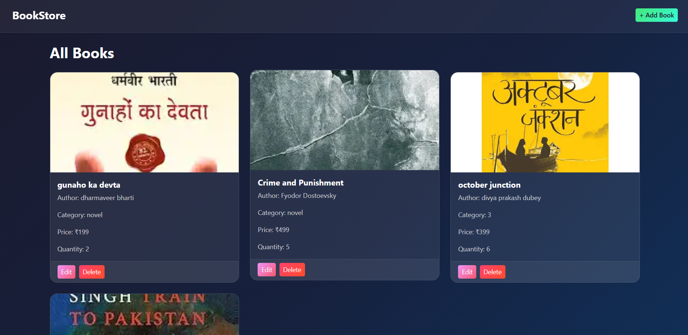
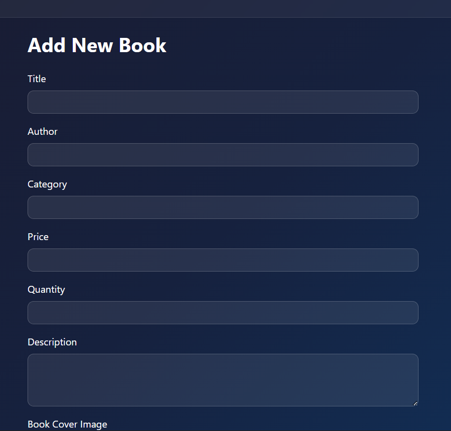
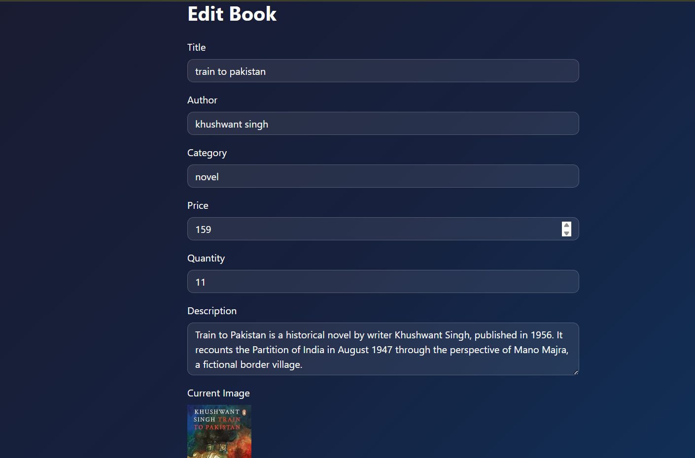
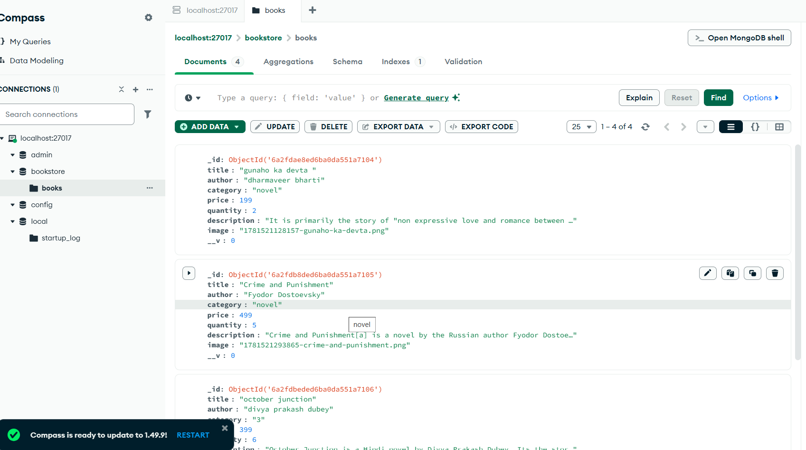

# 📚 BookStore Management System

## Video explanation link

https://drive.google.com/drive/folders/1UGn4-wJe6pvB2LWnhR9a-xw-ZHaRinHl

A full-stack Book Store Management System built with **Node.js**, **Express.js**, **MongoDB**, and **EJS** templating engine. The system supports complete CRUD operations with image upload functionality using Multer.

---

## 🎯 Problem Definition

Build a web-based Book Store Management System where users can efficiently manage book records — add, view, update, and delete books along with book cover image uploads stored in MongoDB database.

---

## 🚀 Features

- ✅ Add new books with cover image upload
- ✅ View all books in card format
- ✅ Edit existing book details
- ✅ Delete books permanently
- ✅ Image upload using Multer
- ✅ MongoDB database storage
- ✅ MVC architecture
- ✅ Responsive Bootstrap UI

---

## 🛠️ Tech Stack

| Technology  | Usage             |
| ----------- | ----------------- |
| Node.js     | Backend Runtime   |
| Express.js  | Web Framework     |
| MongoDB     | Database          |
| Mongoose    | MongoDB ODM       |
| EJS         | Templating Engine |
| Multer      | Image Upload      |
| Bootstrap 5 | UI Styling        |
| Nodemon     | Live Server       |

---

## 📁 Folder Structure

```
BookStore/
│── controllers/
│   └── bookController.js
│── models/
│   └── bookModel.js
│── routes/
│   └── bookRoutes.js
│── views/
│   ├── partials/
│   │   ├── header.ejs
│   │   └── footer.ejs
│   ├── index.ejs
│   ├── add-book.ejs
│   └── edit-book.ejs
│── public/
│   └── css/
│       └── style.css
│── uploads/
│── app.js
└── package.json
```

---

## 🔄 MVC Flow

```
Browser Request
     ↓
app.js (Entry Point + MongoDB Connect)
     ↓
routes/bookRoutes.js (URL Handler + Multer)
     ↓
controllers/bookController.js (Logic)
     ↓
models/bookModel.js (Database Schema)
     ↓
views/*.ejs (UI)
     ↓
Browser Response
```

---

## 🗄️ MongoDB Schema

```javascript
{
  title:       { type: String, required: true },
  author:      { type: String, required: true },
  category:    { type: String, required: true },
  price:       { type: Number, required: true },
  quantity:    { type: Number, required: true },
  description: { type: String },
  image:       { type: String }
}
```

---

## 🔗 Available Routes

| Method | Route              | Description    |
| ------ | ------------------ | -------------- |
| GET    | `/`                | View all books |
| GET    | `/add-book`        | Add book form  |
| POST   | `/add-book`        | Save new book  |
| GET    | `/edit-book/:id`   | Edit book form |
| POST   | `/edit-book/:id`   | Update book    |
| GET    | `/delete-book/:id` | Delete book    |

---

## ⚙️ Installation & Setup

1. **Clone the repository**

```bash
git clone https://github.com/your-username/BookStore.git
cd BookStore
```

2. **Install dependencies**

```bash
npm install
```

3. **Start MongoDB** (make sure MongoDB is running)

4. **Start the server**

```bash
npm run dev
```

5. **Open in browser**

```
http://localhost:8000
```

---

## 📸 Screenshots

### Home — All Books



### Add Book



### Edit Book





---

## 👨‍💻 Developer

**Israr** — Full Stack Development Student

---

## 📄 License

This project is for educational purposes.
