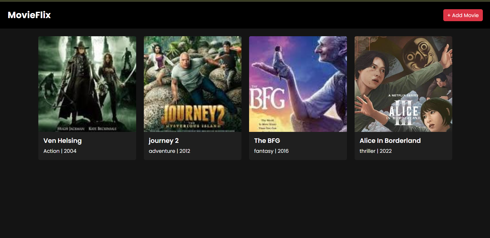
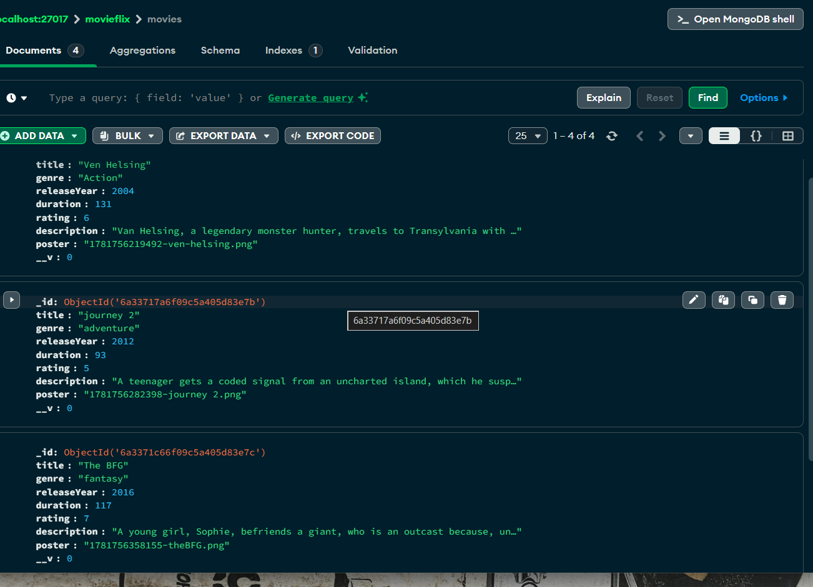
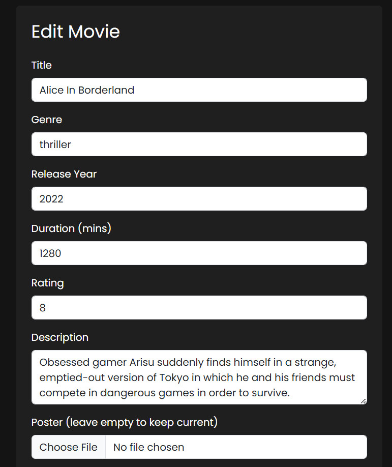
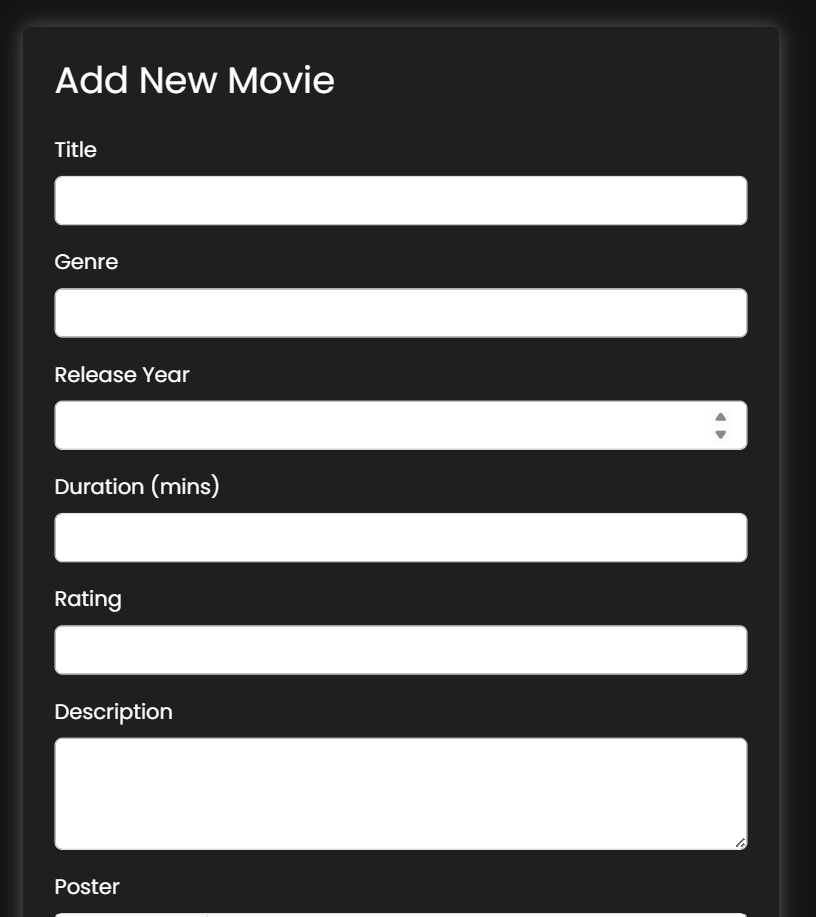

# 🎬 MovieFlix

# Explanation video link
https://drive.google.com/drive/folders/1UGn4-wJe6pvB2LWnhR9a-xw-ZHaRinHl


A full-stack Movie Management System built with **Node.js, Express, MongoDB, Mongoose, Multer, and EJS** using the **MVC architecture**. Styled with a dark, Amazon Prime–inspired UI.

## 📌 Features

- **Add Movies** — Create new movie entries with title, genre, release year, duration, rating, description, and poster image
- **View Movies** — Browse all movies in a responsive card-grid layout
- **Edit Movies** — Update movie details, with the option to replace the poster image
- **Delete Movies** — Remove a movie entry along with its uploaded poster image (automatic file cleanup)
- **Image Upload** — Poster images handled via Multer and stored locally
- **Dark, Prime-style UI** — Bootstrap-based responsive design with custom dark theme, hover effects, and Google Fonts (Poppins)
- **EJS Partials** — Shared navbar component reused across all views

## 🛠️ Tech Stack

| Technology | Purpose |
|---|---|
| Node.js | Runtime environment |
| Express.js | Web framework / routing |
| MongoDB | Database |
| Mongoose | ODM for MongoDB |
| Multer | File upload handling |
| EJS | Templating engine |
| Bootstrap 5 | UI styling |
| Nodemon | Auto-restart during development |

## 📂 Folder Structure

```
MovieFlix/
├── controllers/
│   └── movieController.js
├── models/
│   └── movie.js
├── routes/
│   └── movieRoutes.js
├── views/
│   ├── partials/
│   │   └── navbar.ejs
│   ├── index.ejs
│   ├── add-movie.ejs
│   └── edit-movie.ejs
├── public/
│   └── css/
│       └── style.css
├── uploads/
├── app.js
└── package.json
```

## 🚀 Getting Started

### Prerequisites
- Node.js installed
- MongoDB running locally (`mongodb://localhost:27017`)

### Installation

```bash
# Clone the repository
git clone https://github.com/israrshaikh123/node-js.git

# Navigate to the project
cd node-js/MovieFlix

# Install dependencies
npm install

# Start the server
npm start
```

The app will run on `http://localhost:8000`

## 🗄️ Database Schema

| Field | Type | Required |
|---|---|---|
| title | String | ✅ |
| genre | String | ✅ |
| releaseYear | Number | ✅ |
| duration | Number | ✅ |
| rating | Number | ✅ |
| description | String | ✅ |
| poster | String | ✅ |

## 🔗 Routes

| Method | Route | Description |
|---|---|---|
| GET | `/movies` | List all movies |
| GET | `/movies/add` | Show add movie form |
| POST | `/movies/add` | Create a new movie |
| GET | `/movies/edit/:id` | Show edit movie form |
| POST | `/movies/edit/:id` | Update a movie |
| POST | `/movies/delete/:id` | Delete a movie (and its poster file) |

## 📸 Screenshots










## 👤 Author

**Israr Shaikh**
GitHub: [israrshaikh123](https://github.com/israrshaikh123)

## 📝 License

This project is open source and available for learning purposes.