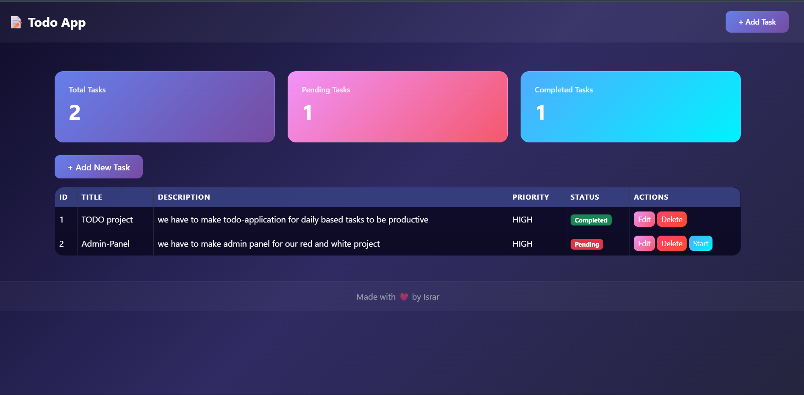
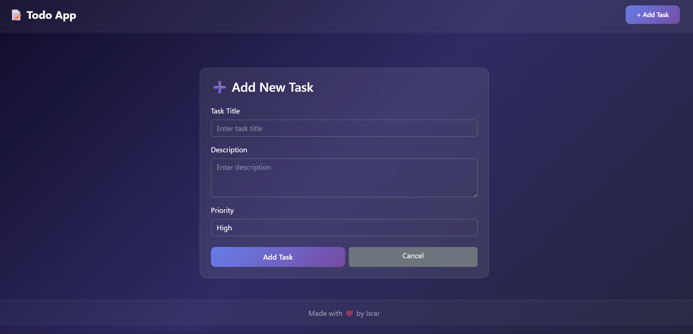
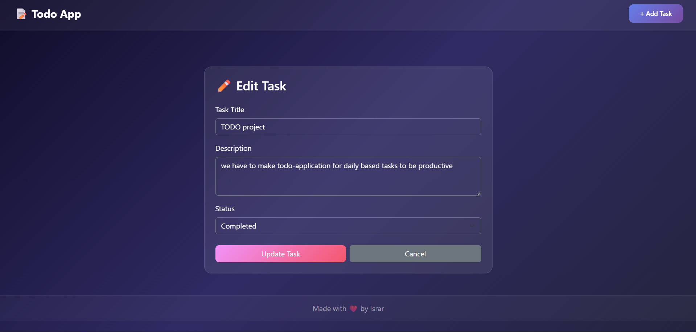

# 📝 Real-Time Todo Management System

A full-stack Todo Management System built with **Node.js**, **Express.js**, and **EJS** templating engine. This application allows users to manage their daily tasks through a professional and responsive interface.

---

## 🚀 Features

- ✅ Add new tasks with title, description, and priority
- ✅ View all tasks in a responsive dashboard
- ✅ Edit existing task details
- ✅ Delete tasks
- ✅ Track task progress — Pending → On Going → Completed
- ✅ Live task statistics (Total, Pending, Completed)

---

## 🛠️ Tech Stack

| Technology  | Usage             |
| ----------- | ----------------- |
| Node.js     | Backend Runtime   |
| Express.js  | Web Framework     |
| EJS         | Templating Engine |
| Bootstrap 5 | UI Styling        |
| CSS3        | Custom Styling    |

---

## 📁 Project Structure

```
TodoApp/
│── views/
│   ├── partials/
│   │   ├── header.ejs
│   │   └── footer.ejs
│   ├── dashboard.ejs
│   ├── add-task.ejs
│   └── edit-task.ejs
│── public/
│   ├── css/
│   │   └── style.css
│   └── images/
│── app.js
└── package.json
```

---

## ⚙️ Installation & Setup

1. **Clone the repository**

```bash
git clone https://github.com/your-username/TodoApp.git
cd TodoApp
```

2. **Install dependencies**

```bash
npm install
```

3. **Start the server**

```bash
node app.js
```

4. **Open in browser**

```
http://localhost:3000
```

---

## 📸 Screenshots

### Dashboard



### Add Task



### Edit Task

## 

## 📌 Task Object Structure

```javascript
{
  id: 1,
  title: "Prepare Report",
  description: "Complete weekly project report",
  priority: "High",
  status: "Pending"
}
```

---

## 🔄 Status Flow

```
Pending  →  On Going  →  Completed
```

---

## 👨‍💻 Developer

**Israr** — Full Stack Development Student

---

## 📄 License

This project is for educational purposes.
