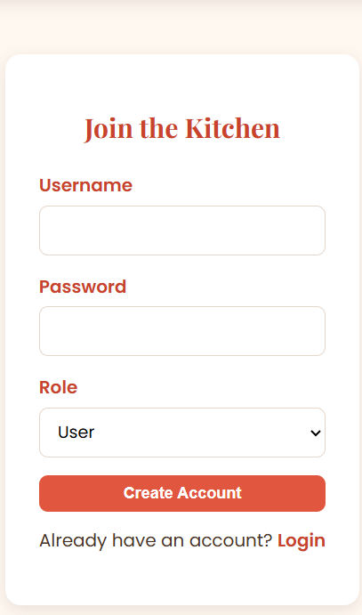
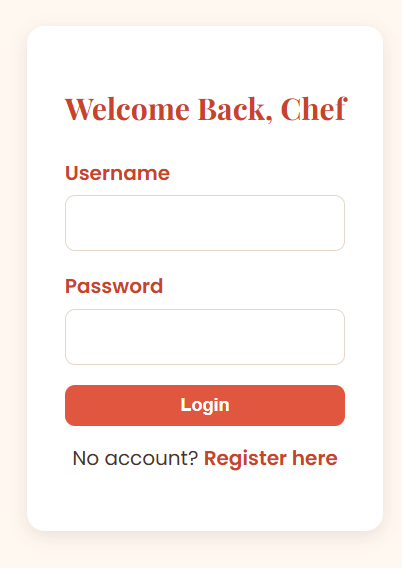
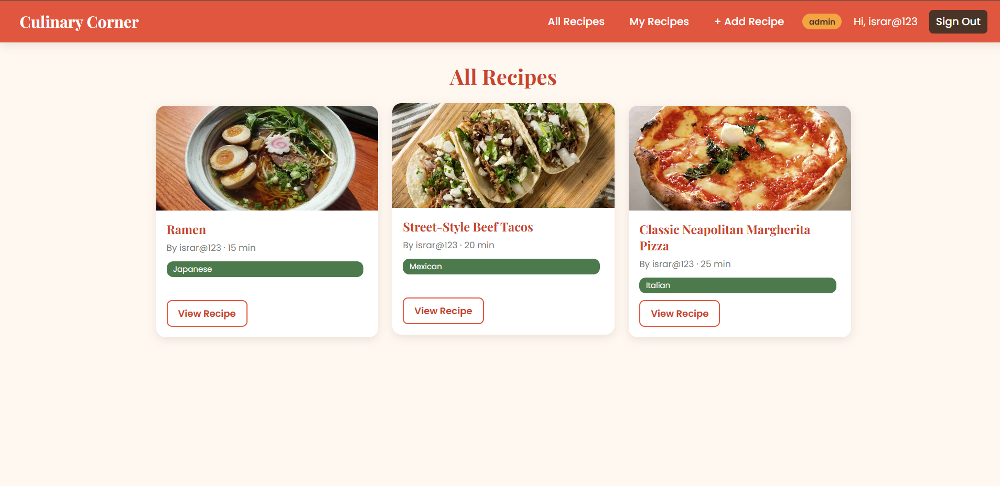
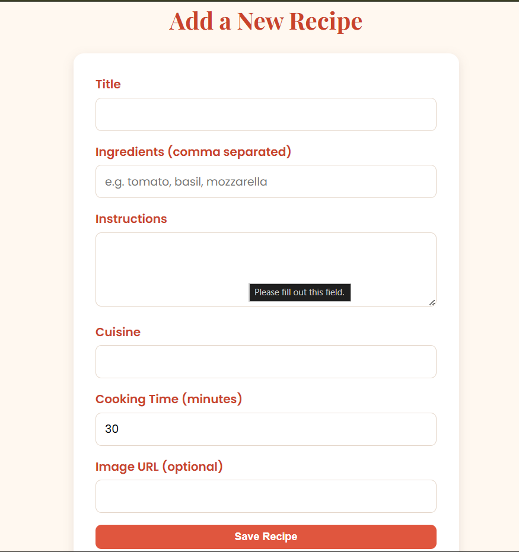
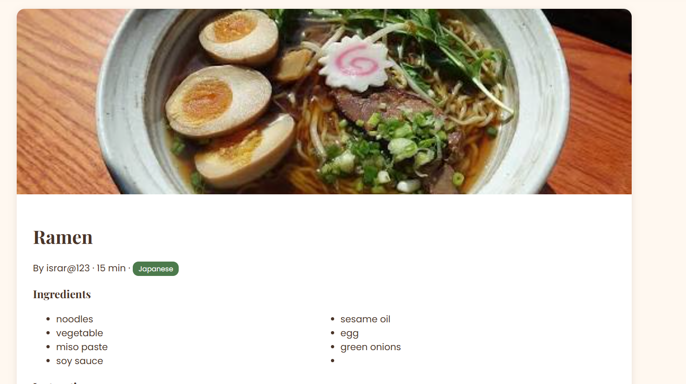
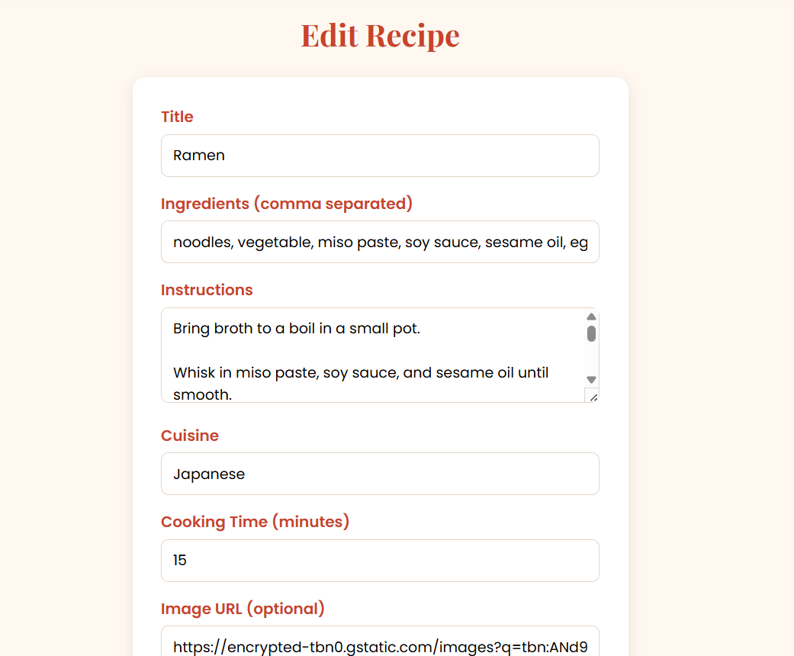
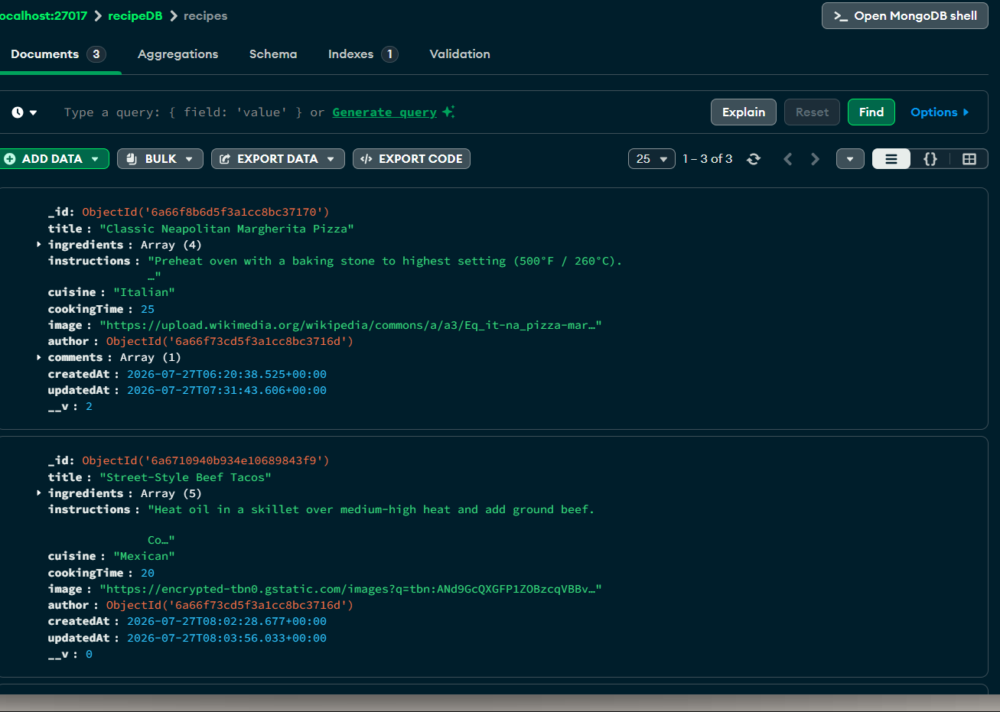
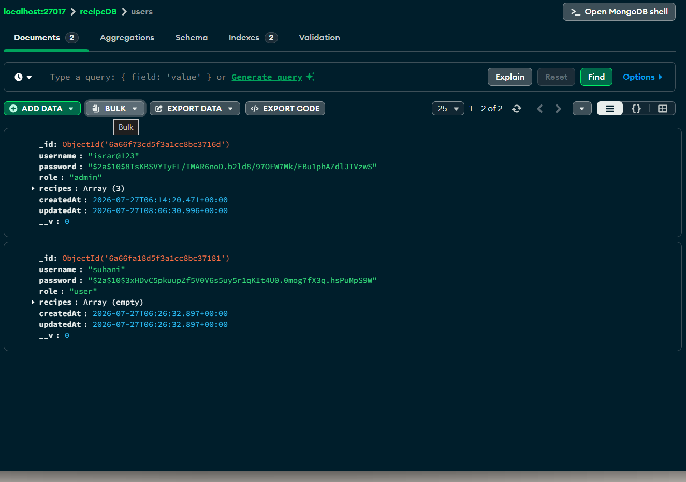

---

## ⚙️ Setup & Installation

### 1. Prerequisites
- [Node.js](https://nodejs.org/) (v18+ recommended)
- [MongoDB](https://www.mongodb.com/try/download/community) running locally, or a free [MongoDB Atlas](https://www.mongodb.com/atlas) cluster

### 2. Install dependencies
```bash
npm install
```

### 3. Configure environment variables
Create a `.env` file in the root directory (or edit the existing one):
```env
MONGO_URI=mongodb://127.0.0.1:27017/recipeDB
JWT_SECRET=your_secret_key_here
PORT=3000
```

### 4. Run the app
```bash
npm start
```
Or, for development with auto-restart on file changes:
```bash
npm run dev
```

The app will be available at **http://localhost:3000**

---

## 🔑 How Authentication Works

1. User registers or logs in via `/register` or `/login`.
2. On success, the server signs a JWT containing `{ id, username, role }` and sends it back as an **HTTP-only cookie**.
3. On every request, the `attachUser` middleware reads the cookie, verifies the token, and attaches the decoded user to `req.user` and `res.locals.user`.
4. The `protect` middleware blocks access to routes if no valid user is attached — redirecting to `/login`.
5. The `authorizeRoles()` middleware can further restrict routes to specific roles (e.g. `admin`).
6. `/logout` simply clears the cookie.

---

## 🧭 Routes Overview

### Auth Routes

| Method | Route       | Description                         |
| ------ | ----------- | ----------------------------------- |
| GET    | `/register` | Show registration form              |
| POST   | `/register` | Create new user                     |
| GET    | `/login`    | Show login form                     |
| POST   | `/login`    | Authenticate user, issue JWT cookie |
| GET    | `/logout`   | Clear JWT cookie                    |

### Recipe Routes (all protected)

| Method | Route               | Description                            |
| ------ | ------------------- | -------------------------------------- |
| GET    | `/recipes`          | View all recipes from all users        |
| GET    | `/recipes/mine`     | View only the logged-in user's recipes |
| GET    | `/recipes/new`      | Show form to add a new recipe          |
| POST   | `/recipes`          | Create a new recipe                    |
| GET    | `/recipes/:id`      | View a single recipe                   |
| GET    | `/recipes/:id/edit` | Show edit form (owner/admin only)      |
| PUT    | `/recipes/:id`      | Update a recipe (owner/admin only)     |
| DELETE | `/recipes/:id`      | Delete a recipe (owner/admin only)     |

---

## 👤 Roles

| Role    | Permissions                                                |
| ------- | ---------------------------------------------------------- |
| `user`  | Register, log in, add recipes, edit/delete **own** recipes |
| `admin` | All user permissions + edit/delete **any** recipe          |

---

## 📸 Screenshots

> All screenshots are located in the `screenshots/` folder.

### 1. Register Page



### 2. Login Page



### 3. Dashboard (All Recipes)



### 4. Add Recipe



### 5. View Recipe



### 6. Edit Recipe



### 7. MongoDB Compass — Users Collection



### 8. MongoDB Compass — Recipes Collection

## 

## 🚀 Future Improvements

- Search and filter recipes by cuisine or ingredients
- Recipe ratings and likes
- Image upload support instead of image URLs
- Pagination for the recipe list
- Admin dashboard for managing all users and recipes

---

## 👨‍🍳 Author

Built as a Node.js practical exam project — Recipe Sharing Platform with JWT auth, role-based access, and a culinary theme.
